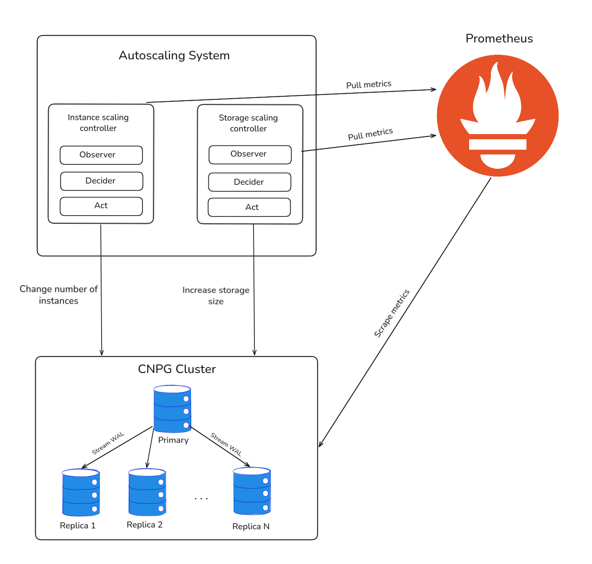
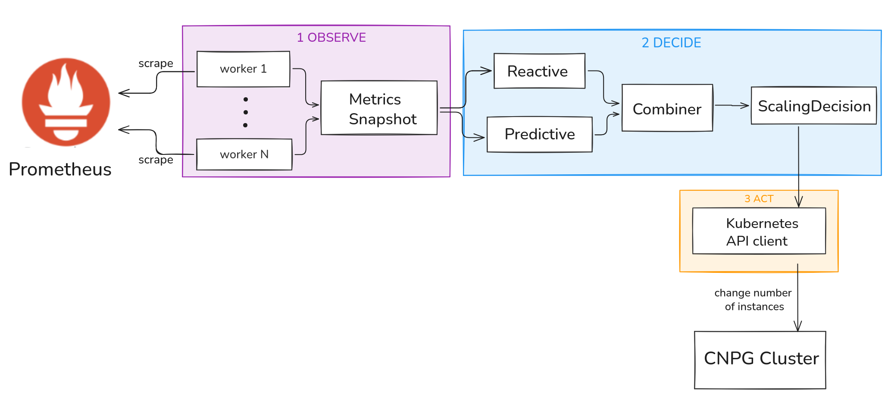
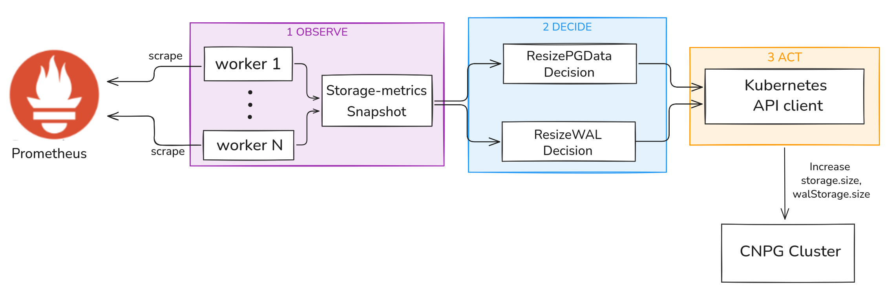

# Auto-scaling PostgreSQL Cluster on Kubernetes

Two cooperative autoscaling controllers for PostgreSQL on Kubernetes: one scales the number of instances based on database-level signals, the other expands storage before it runs out.

## Overview

The system uses Prometheus as its single data source. All signals from PostgreSQL instances and the kubelet are scraped into Prometheus and can be filtered and computed via PromQL. The two controllers query Prometheus independently on their own poll cycles and act on the same CNPG `Cluster` resource, but write to different fields: `spec.instances` for instance count and `spec.storage.size` for disk capacity. The CNPG operator reconciles the cluster toward the new declared state.

Data flows in two independent, continuous directions:

**Collection** - Prometheus scrapes `postgres_exporter` on each PostgreSQL instance (application-layer signals: active connections, TPS, average query latency, etc.) and the kubelet (infrastructure-layer signals: CPU, memory, disk).

**Control** - On each poll cycle, each controller runs its own Observe-Decide-Act loop independently. The instance-scaling controller queries connection count, TPS, and average latency, computes a desired replica count, and patches `spec.instances` when a change is needed. The storage-scaling controller queries disk usage and growth rate, and patches `spec.storage.size` or `spec.walStorage.size` when exhaustion is projected. Once a patch is written, the CNPG operator reconciles the actual cluster state toward the new spec - creating or removing replicas, expanding PVCs via the CSI driver, and so on.




## Instance-scaling Controller

The controller is organized as a three-stage Observe-Decide-Act pipeline that runs every `pollInterval`.



**Observe** - `PrometheusMetricsObserver` queries all configured metrics in parallel. It keeps a `lastGoodValues` map as short-term memory: if Prometheus returns 0 (e.g. because the `rate()` window has not yet aligned with the scrape interval), the last known positive value is used instead. The main controller appends each snapshot to a per-metric rolling history buffer (24h retention) that the predictor reads from.

**Decide** - The controller computes two independent targets and takes their maximum:

- *Reactive target*: for each metric, `ceil(value / targetValuePerReplica)` gives the desired replica count. Multiple metrics are aggregated via `max` or `weighted_average`. Scale-up fires if any metric exceeds its `scaleUpThreshold`; scale-down only fires when all metrics are below their `scaleDownThreshold` continuously for the stabilization window.
- *Predictive target*: the pluggable `Predictor` interface receives the history buffer and a horizon duration and returns a forecast value, which is mapped to a replica count the same way as the reactive path.

The final target is `max(reactive, predictive)`, clamped to `[minInstances, maxInstances]`. The `scalingMode` field can restrict which path is active: `reactive`, `predictive`, or `hybrid` (default).

A cooldown window prevents back-to-back scaling actions.

**Act** - `CNPGClient` patches `spec.instances` on the CNPG `Cluster` CRD via the Kubernetes API.

**Pluggable predictors:**

```go
// Moving average (built-in)
controller.WithPredictor(scale.NewMovingAveragePredictor(10))

// EWMA + linear trend extrapolation (built-in)
controller.WithPredictor(scale.NewEWMAPredictor(alpha))

// Custom inline algorithm
controller.WithPredictor(scale.NewPredictorFunc("my_algo",
    func(ctx context.Context, history []scale.DataPoint, horizon time.Duration) (float64, error) {
        return forecast, nil
    },
))
```

**Configuration reference:**

```yaml
minInstances: 1
maxInstances: 6
pollInterval: 30s
cooldown: 60s
scalingMode: hybrid # reactive | predictive | hybrid
aggregation: max # max | weighted_average
scaleDownStabilizationWindow: 2m

metrics:
  - name: active_connections
    query: 'sum(cnpg_backends_total{...})'
    scaleUpThreshold: 80
    scaleDownThreshold: 20
    targetValuePerReplica: 50
    weight: 1.0

prediction:
  enabled: true
  type: holt_winters # moving_average | ewma | holt_winters
  metricName: active_connections
  horizon: 5m
  minHistoryDuration: 1h
```

## Storage-scaling Controller

The storage controller prevents database crashes from disk exhaustion and avoids over-provisioning by expanding storage only when needed.



It tracks two volumes independently: `pgdata` (table and index data) and `walStorage` (WAL). On each poll cycle it observes:

- Current usage percentage
- Projected time-to-full based on the recent growth rate

A resize is triggered when usage crosses a configurable threshold or when the time-to-full falls below a configurable horizon (preemptive resize). Because PVC expansion is irreversible, the controller applies additional safety guards before acting: it blocks a resize if a previous expansion is still propagating through the CSI layer (the PVC capacity metric has not yet caught up), and it enforces a cooldown between consecutive resizes. A critical threshold bypasses the cooldown.

Each resize step expands the current size by a fixed percentage, capped at a configured maximum.

**Configuration reference:**

```yaml
pgdata:
  scaleUpThresholdPercent: 70
  criticalThresholdPercent: 90
  stepPercent: 30
  maxSizeGi: 500
  cooldown: 10m
  preemptiveResizeIfFullInHours: 12

walStorage:
  scaleUpThresholdPercent: 65
  criticalThresholdPercent: 85
  stepPercent: 50
  maxSizeGi: 100
  cooldown: 10m
  preemptiveResizeIfFullInHours: 6
```

## Load Generator

The load generator drives synthetic traffic against the PostgreSQL cluster using a custom `pgbench`-based workload (`pgbench_read_heavy`). It accepts a scenario file that describes a sequence of steps, each with a duration, a starting RPS, and an optional ending RPS for linear ramp. The generator interpolates RPS linearly within each step and prints per-interval TPS, P50/P95/P99 latency, and error counts.

**Scenario format:**

```yaml
name: sudden_spike
steps:
  - duration: 60s
    rps: 300
  - duration: 90s
    rps: 1100
  - duration: 40s
    rps: 300
```

Available scenarios:

| Scenario | Description |
|---|---|
| `gradual_ramp` | Steady linear ramp from 50 to 1800 RPS |
| `sudden_spike` | Abrupt jumps to stress reactive scaling |
| `periodic_wave` | Repeating peaks for testing predictive scaling |
| `real_world_mix` | Ramp + spike + plateau + second ramp |
| `connection_exhaustion` | Sustained high connection load |
| `storage_steady` | Constant low write rate for baseline storage growth |
| `storage_bursty` | Alternating burst and idle for storage stress |
| `storage_migration` | Data ingestion pattern simulating a migration |


## How to run

The experiment was conducted on **Google Cloud Platform** using GKE. All `make` commands below run from `hack/spin-up/`.

### Prerequisites

- `gcloud` CLI authenticated and a GCP project set as default
- `kubectl`, `helm`
- Go 1.25+ (for building controllers locally)

### 1. Provision the GKE cluster

```bash
cd hack/spin-up
make init-setup-gke PROJECT_ID=<your-project-id>
```

This single target runs the full setup sequence:

1. Creates a GKE cluster with a `default-pool` node (for loadgen) and a `pg-pool` of 5 nodes (for database instances)
2. Installs the CNPG operator
3. Installs the Prometheus stack (kube-prometheus-stack via Helm)
4. Enables the GCE CSI driver and VolumeSnapshot controller
5. Provisions a GCS bucket, a Google Service Account for WAL archiving, and wires Workload Identity
6. Installs the Barman Cloud plugin for CNPG
7. Applies the CNPG `Cluster`, `ObjectStore`, `ScheduledBackup`, and monitoring manifests
8. Initializes pgbench data at scale factor 50

Grafana is available on port 3000 after running:

```bash
make grafana-forward
```

### 2. Build the controllers

```bash
# Instance-scaling controller
go build -o scale-controller ./cmd/scale-controller

# Storage-scaling controller
go build -o storage-controller ./cmd/storage-controller
```

### 3. Run the instance-scaling controller

The controller reads configuration from a YAML file and watches it for live changes.

```bash
./scale-controller \
  --config=scale-controller-config/hybrid.yaml \
  --prometheus-addr=http://localhost:9090 \
  --namespace=default \
  --db-cluster=pg-cluster \
  --watch-interval=10s \
  --metrics-addr=:9091
```

Pre-built configuration profiles are in `scale-controller-config/`:

| Profile | Description |
|---|---|
| `hybrid.yaml` | Holt-Winters prediction + reactive SLO guard (default experiment config) |
| `reactive-only.yaml` | Reactive-only, no predictor |
| `predictive-only.yaml` | Predictive-only, falls back to current replicas when history is insufficient |

### 4. Run the storage-scaling controller

```bash
./storage-controller \
  --config=config.storage-example.yaml \
  --prometheus-addr=http://localhost:9090 \
  --namespace=default \
  --db-cluster=pg-cluster
```

### 5. Run a load scenario

```bash
cd loadgen
go run ./cmd/loadgen run \
  --scenario=scenarios/real-world-mix.yaml \
  --db-url="postgres://app:password@<cluster-rw-ip>/app" \
  --concurrency=100
```

### 6. Auto-run benchmark harness (optional)

For unattended overnight benchmark runs, deploy the auto-run server into the cluster:

```bash
kubectl apply -f auto-run/k8s/rbac.yaml
kubectl apply -f auto-run/k8s/configmap-matrix.yaml
kubectl apply -f auto-run/k8s/deployment.yaml
kubectl apply -f auto-run/k8s/service.yaml
```

Edit the run matrix via the web UI:

```bash
kubectl port-forward svc/auto-run 8080:8080
# open http://localhost:8080
```

The matrix defines which controller config and scenario to pair for each run. The harness executes them sequentially - reset cluster, deploy controller, run loadgen, collect metrics from Prometheus as CSV, upload to GCS - without any manual intervention.

## Tech Stack

| Component | Version | Role |
|---|---|---|
| Kubernetes (GKE) | v1.35.3 | Container orchestration platform |
| CloudNativePG (CNPG) | v1.28.0 | PostgreSQL cluster lifecycle operator |
| Barman Cloud plugin | v0.11.0 | WAL archiving and backup to GCS |
| PostgreSQL | 18.1 | Database engine |
| Prometheus | v3.11.2 | Metrics collection and storage |
| Grafana | 12.4.3 | Metrics visualization and dashboards |
| Go | 1.25.0 | Controller implementation language |
