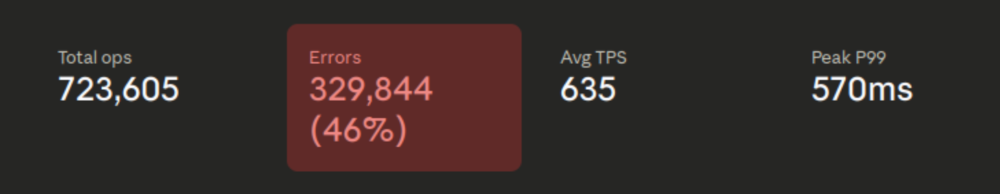
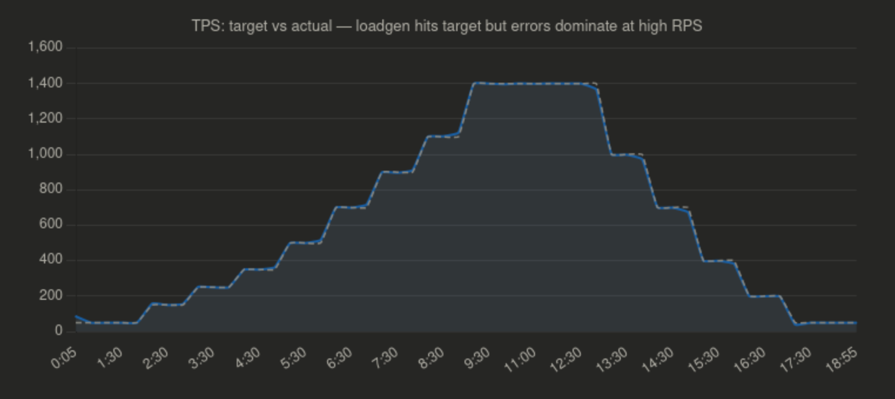
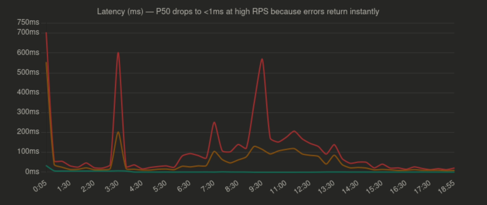
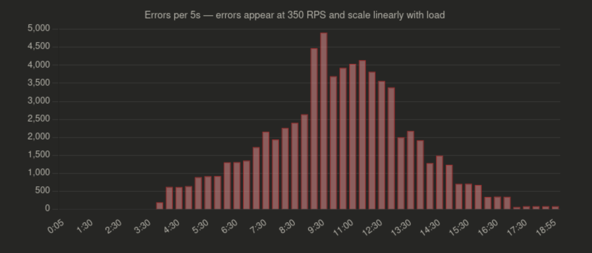
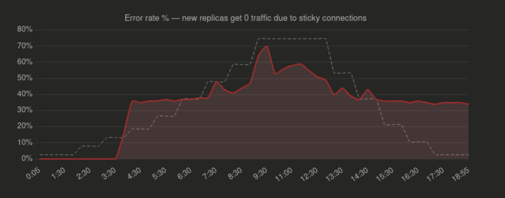
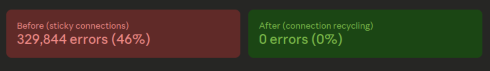
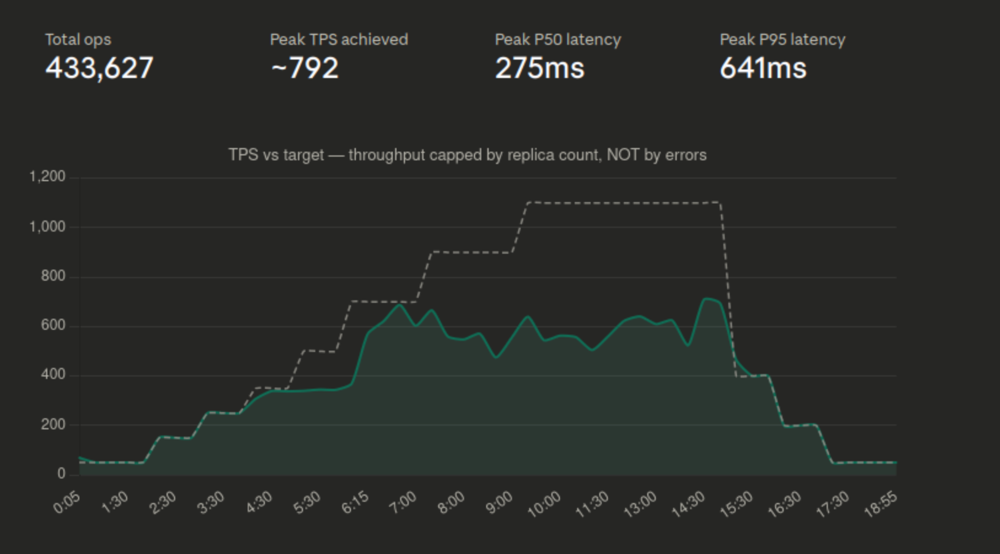
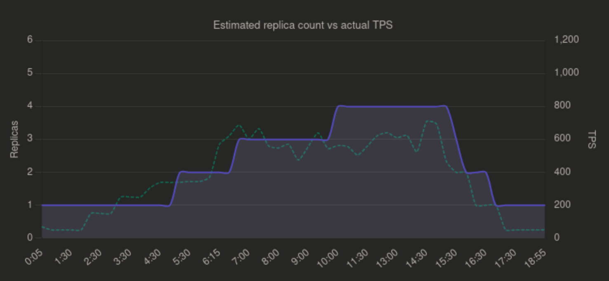
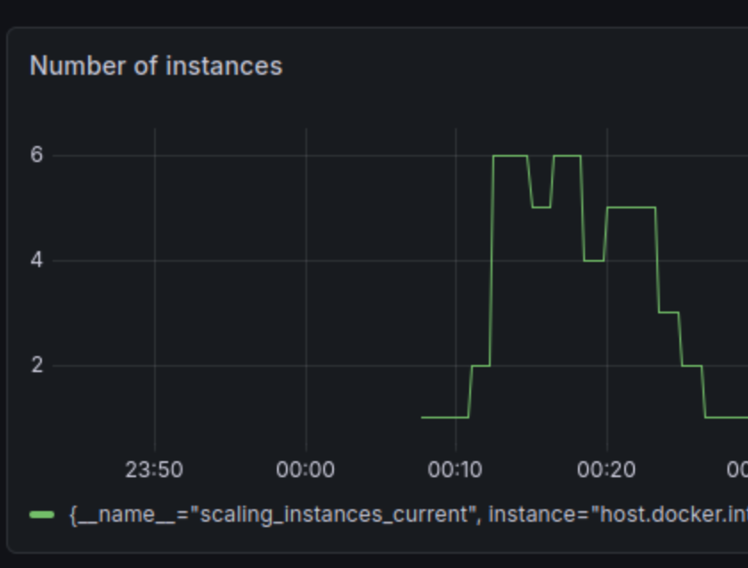

### First run, found out load balancing error when keeping connection alive for too long











### Second run (after fix load balance error)

```
╔═══════════════════════════════════════╗
║           Final Summary               ║
╠═══════════════════════════════════════╣
║  Duration:      18m59.966s            ║
║  Total Ops:     433876                ║
║  Errors:        0                     ║
║  TPS:           380.60                ║
║  P50 Latency:   93.311ms              ║
║  P95 Latency:   350.975ms             ║
║  P99 Latency:   524.799ms             ║
║  P99.9 Latency: 767.487ms             ║
╚═══════════════════════════════════════╝
```












Ở phase 900-1100 RPS, actual TPS chỉ ~500-700 và actual TPS không bao giờ đạt đủ target, điều này là do hoặc controller chưa scale đủ nhanh hoặc chưa đủ replica. Tuy nhiên theo hình vẽ mình có thấy lên được tới mức 6 instance rồi nhưng có vẻ như vấn đề là do không đủ số lượng node gke để phục vụ việc test.ii