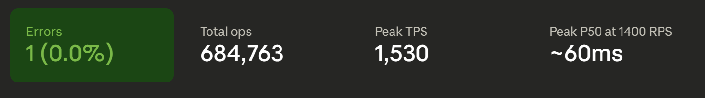
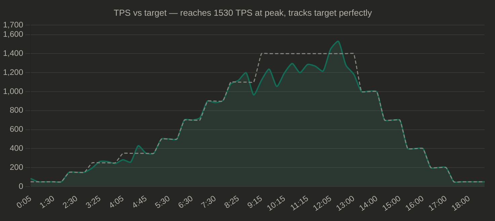
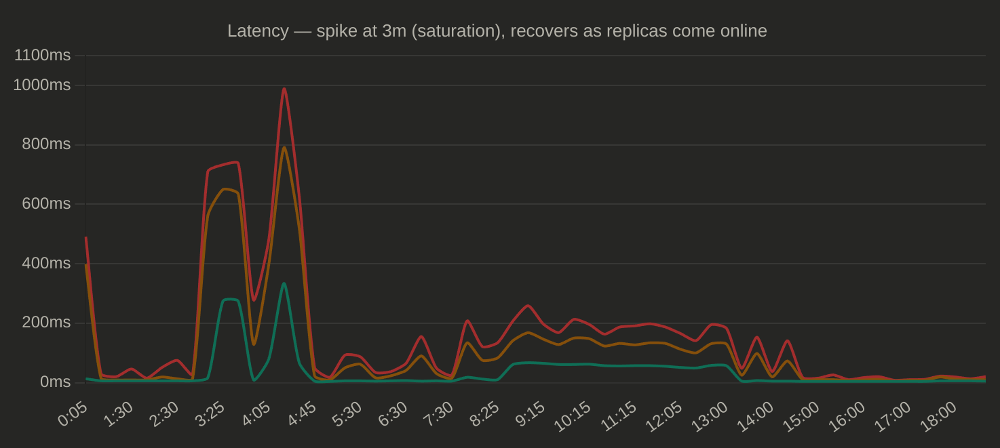
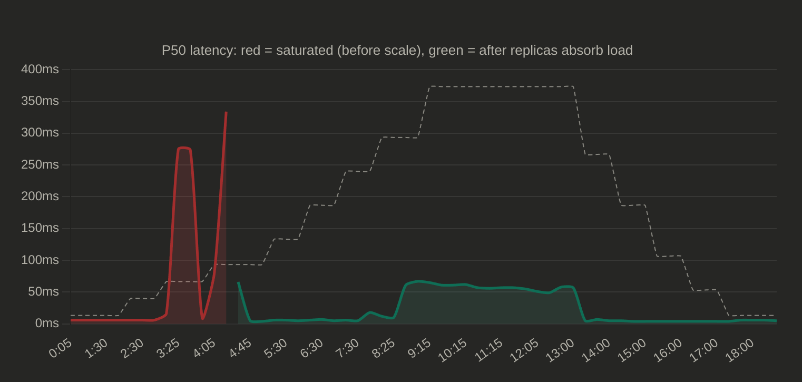
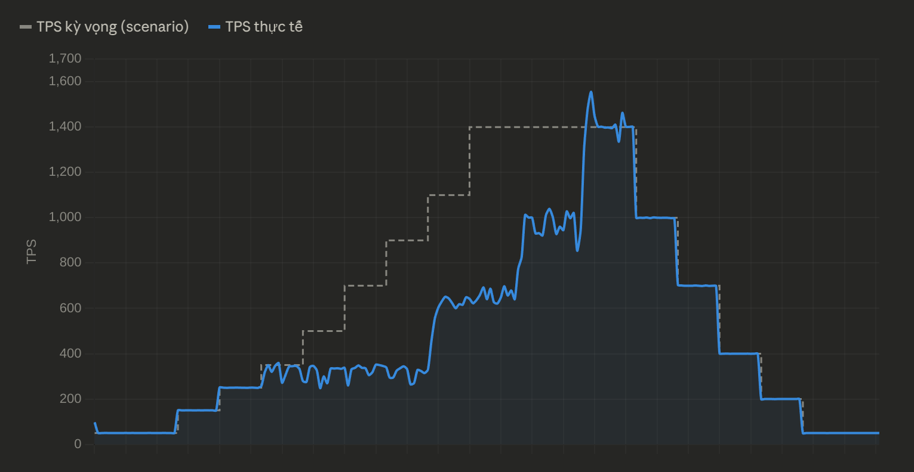

### First run, found out load balancing error when keeping connection alive for too long


### Second run (after fix load balance error)

```
╔═══════════════════════════════════════╗
║           Final Summary               ║
╠═══════════════════════════════════════╣
║  Duration:      18m59.966s            ║
║  Total Ops:     433876                ║
║  Errors:        0                     ║
║  TPS:           380.60                ║
║  P50 Latency:   93.311ms              ║
║  P95 Latency:   350.975ms             ║
║  P99 Latency:   524.799ms             ║
║  P99.9 Latency: 767.487ms             ║
╚═══════════════════════════════════════╝
```


Ở phase 900-1100 RPS, actual TPS chỉ ~500-700 và actual TPS không bao giờ đạt đủ target, điều này là do hoặc controller chưa scale đủ nhanh hoặc chưa đủ replica. Tuy nhiên theo hình vẽ mình có thấy lên được tới mức 6 instance rồi nhưng có vẻ như vấn đề là do không đủ số lượng node gke để phục vụ việc test.ii


### Third run
Lần chạy này đã có tận 6 node nên không quá lo lắng về tranh chấp tài nguyên nữa 

sau khi fix một số lỗi liên quan đến private node, disk request thì cuối cùng cũng có thể test











TPS đạt 1530 ở peak (target 1400), P50 ổn định ~55-65ms ở sustained load
=> 6 nodes giải quyết hoàn toàn bottleneck trước đó

Trong 90s phút 3:05-4:35, P50 nhảy lên 275-334ms khi 1 replica bị quá tải, recovery rất nhanh khi replica mới được tạo rớt xuống 66ms rồi xuống 5ms 


### 4th run
Lần chạy Hybrid này cho kết quả tệ vì có 2 vấn đề
1. TPS = 0 liên tục do Prometheus rate(...[1m]) không align với scrape interval.
2. Flapping kinh khủng khi

```
17:35:54  scale 2 -> 6   (backends=76, tps=0)
17:37:24  scale 6 -> 3   (tps=0, backends=0), scale down giữa lúc load cao
17:38:54  scale 3 -> 6   (backends=80)
17:40:24  scale 6 -> 5   (tps=0, backends=3), scale down again ?
17:41:54  scale 5 -> 6
17:45:25  scale 6 -> 4   scale down
17:46:54  scale 4 -> 2   scale down
```

### 5th run



### 6th run


### 7th run

### 8th run
